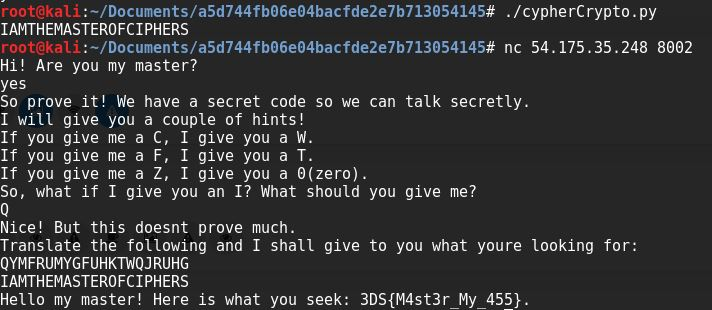

Le 318br, DESEC, and SucuriHC Capture The Flag (3DSCTF) est la première édition d'une compétition brésilienne où il permettait de tester les compétences "d'hackers" dans le pays organisateur. Les épreuves étaient rangées par points.

<h2>Prise de connaissance</h2>
Avec la commande :
<pre>nc 54.175.35.248 8002</pre>
On se connecte au serveur et il nous demande :
<pre>Hi! Are you my master ?</pre>
On répond
<pre>yes</pre>
Puis s'affiche
<pre>So prove it! We have a secret code so we can talk secretly.
I will give you a couple of hints!
If you give me a C, I give you a W.
If you give me a F, I give you a T.
If you give me a Z, I give you a 0(zero).
So, what if I give you an I ? What should you give me ?</pre>
&nbsp;
<h2>Début du challenge</h2>
Je recherche la logique en regardant ce qu'il nous donne, on remarque que plus on avance dans l'alphabet, plus la lettre remonte.

En regardant du côté de l'ASCII , on apercoit que la somme fait 154 :

C (<strong>67</strong>) + W (<strong>87</strong>) = <strong>154</strong>

F (<strong>70</strong>) + T (<strong>84</strong>) = <strong>154</strong>

Donc pour trouver l'inverse de I, on fait <strong>154</strong> - I (<strong>73</strong>) = <strong>81</strong> (Q)

On répond donc Q.
<pre>Nice! But this doesnt prove much.
Translate the following and I shall give to you what youre looking for:
QYMFRUMYGFUHKTWQJRUHG</pre>
&nbsp;
<h2>Création d'un script</h2>
Pour répondre au problème, nous allons créer un script lisant une chaine de caractère et cherchant l'inverse.

``` python
#!/usr/bin/env python2

cypher="QYMFRUMYGFUHKTWQJRUHG"
decode=''

for i in cypher:
	decode += chr(154- ord(i))

print (decode)
```

On lance le script et on trouve cela :



Flag trouvé :<strong> 3DS{M4st3r_My_455}</strong>