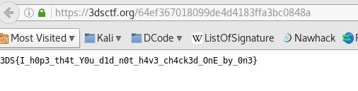

Le 318br, DESEC, and SucuriHC Capture The Flag (3DSCTF) est la première édition d’une compétition brésilienne où il permettait de tester les compétences « d’hackers » dans le pays organisateur. Les épreuves étaient rangées par points.

<h2>Enoncé du challenge</h2>
<pre>Santa walks into a bar and creates a friendship bound with you.
After some shots, he spells to you his secrets to delivery all gifts on Christmas: he has a magical linked list that inform the next kiddie to visit.
At the end of the night, he goes alway and left behind his wallet and the bag with the list of gifts to delivery. Try to discover if you will receive something.</pre>
Et il y avait avec un ZIP à télécharger.

<h2>Analyse</h2>
Lorsqu'on dézippe, on trouve une image PNG et un dossier contenant beaucoup d'images.

Dans le dossier, ce sont des QR-Codes et il y en a plus de 10 000.

<h2>Résolution</h2>
On voit avec quelques tests que les réponses des QR-Code sont sous différentes formes :

- Next name is XXXXX in YYYYYYYYYYYYY
- A kid called XXXXX in YYYYYYYYYYYYY
- Next kiddie is XXXXX in YYYYYYYYYYYYY
- Now I have XXXXX in YYYYYYYYYYYYY

On crée un script pour sortir tous les solutions des QR-Code dans un fichier txt.

``` python
#!/usr/bin/env python2
# -*- coding: utf8 -*-

#PIL est un package gérant les images
from PIL import Image
import os
import zbarlight
#Pour les requêtes
for fil in os.listdir("list"):
	qrco= Image.open('list/'+fil)
	qrco.load()
	q = zbarlight.scan_codes('qrcode',qrco)
	print("\n"+fil)
	print(q)
```
On fait des recherches sur ce fichier pour chercher notre cadeau.

Et on trouve une ligne intéressante :
<pre>Y0ur gift is in goo.gl/wFGwqO inugky3leb2gqzjanruw42yk</pre>
On va le site qui nous redirige vers :



Flag : <strong>3DS{I_h0p3_th4t_Y0u_d1d_n0t_h4v3_ch4ck3d_OnE_by_0n3}</strong>