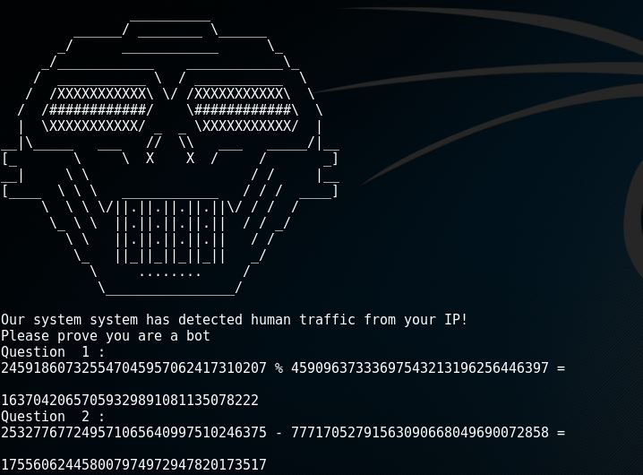
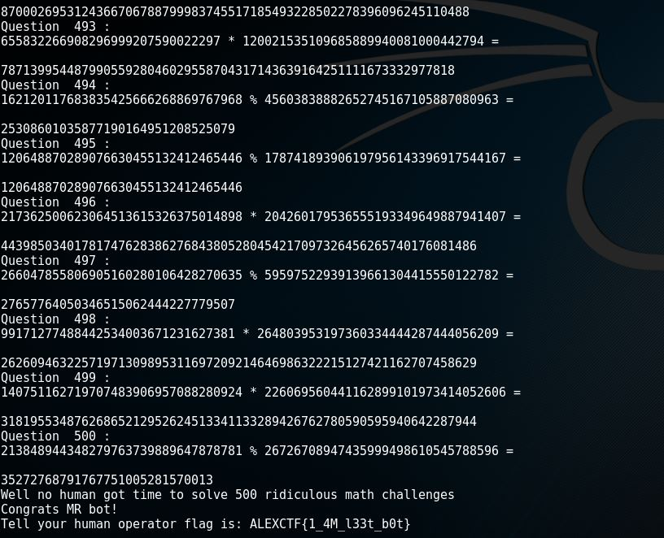

Challenge présenté lors du premier CTF organisé par le MSP TechClub, rattaché à la faculté d'ingénierie, à Alexandrie.

<h2>1. Énoncé</h2>
Voici l'énoncé :
<pre>It is well known that computers can do tedious math faster than human.

nc 195.154.53.62 1337</pre>
On s'y connecte et on fait quelques tests :



Il faut donc répondre aux différentes questions mathématiques...
<h2>2. Création d'un script</h2>
Na sachant pas quand cela s’arrêtera, il est préférable de scripter cela.

``` python
#!/usr/bin/env python

import socket, sys

server ="195.154.53.62"
port = 1337

botMath = socket.socket(socket.AF_INET, socket.SOCK_STREAM)
print "connecting to:"+server

botMath.connect((server, port))
text = botMath.recv(2040)
print text

while 1:
        while(text =='\n'):
                text = botMath.recv(2040)
        print(text)

        texte = text.split('\n')
        for te in texte:
                if("=" in te):
                        nbre1= te.split(" ")[0]
                        opera= te.split(" ")[1]
                        nbre2= te.split(" ")[2]

        if(opera == "+"):
                reponse = int(nbre1) + int(nbre2)
        elif(opera == "-"):
                reponse = int(nbre1) - int(nbre2)
        elif(opera == "/"):
                reponse = int(nbre1) / int(nbre2)
        elif(opera =="%"):
                reponse = int(nbre1) % int(nbre2)
        else:
                reponse = int(nbre1) * int(nbre2)
        botMath.send(str(reponse)+"\n")
        print(reponse)
        text='\n'
```
		
<h2>3. Récupération du flag</h2>
On lance le script et le flag apparait au bout de ... 500 calculs.

