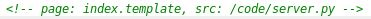
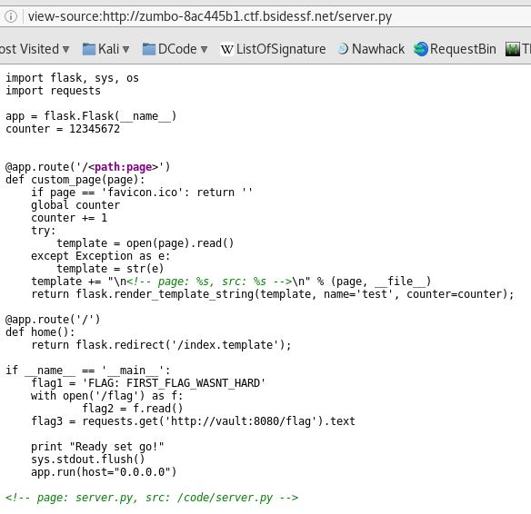
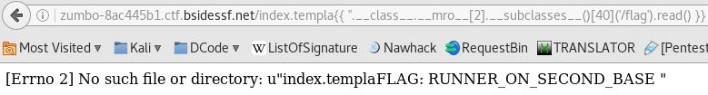

Challenges de web présentés lors du CTF online BSides San Francisco 2017.
Ces challenges étaient au nombre de 3 et il fallait trouver les différents flags, ici je présenterai la démarche pour avoir les deux premiers (qui sont dans la continuité).

<h2>Le site</h2>
Nous avons un lien allant sur ce site :

<h2>Récupération du premier flag</h2>
En observant le code source, nous voyons un commentaire intéressant :

Cherchons cette page, et on trouve :

Le code du serveur avec le premier flag :D
<strong>FLAG: FIRST_FLAG_WASNT_HARD</strong>
<h2>Récupération du deuxième flag</h2>
Ensuite, nous voyons que le framework utilisé par le site est <strong>flask.</strong>

Or on insérer du code dans l'URL sous la forme {{7*7}} qui nous donnera 49.
On insère donc cela :

{{ ''.__class__.__mro__[2].__subclasses__()[40]('/flag').read() }}

Qui permet de lire le contenu du fichier flag. et cela nous donne :

On trouve donc le flag :<strong> "FLAG: RUNNER_ON_SECOND_BASE"</strong>