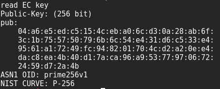
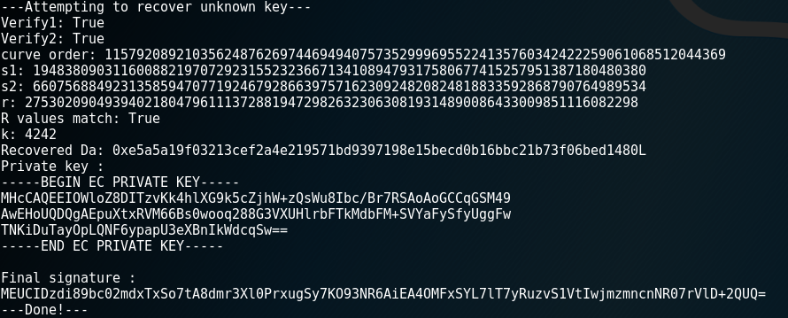
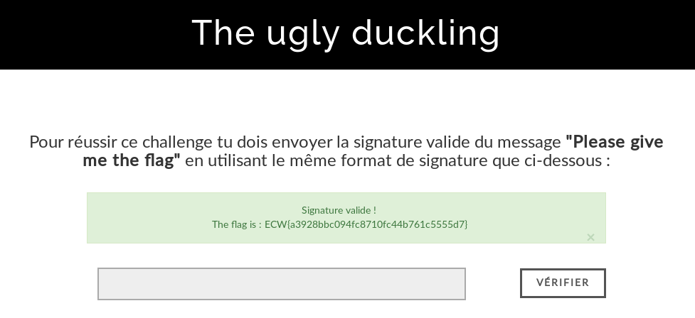

Challenge présenté lors des phases de qualification à l'European Cyber Week 2017. L'ECW est un évènement organisé par la région Bretagne en collaboration avec l'Union Européenne, le ministère de la Défense et la ville de Rennes et a eu lieu du 27 novembre au 1er décembre.

Pour l'occasion, un CTF étudiant a été organisé, comportant des qualifications en ligne pour la final du 29 novembre. "The ugly duckling" est le 3ème challenge de crypto.

<h2>1. Environnement du challenge</h2>
Lorsqu'on arrive sur la page du challenge, on y voit un formulaire avec une consigne au dessus :
<pre>Pour réussir ce challenge, tu dois envoyer la signature valide du message "<strong>Please give me the flag</strong>" en utilisant le même format de signature que ci-dessous :</pre>

En dessous, il se trouvait des textes en clair avec la signature associée et la clé publique pour vérifier la signature.

Le but du challenge est donc de retrouver la clé privée afin de signer avec. La méthode de signature utilisée est ECDSA, les courbes ellyptiques !
<br/>Regardons la clé publique :
```bash
openssl ec -noout -text -in key.pub -pubin
```



En faisant quelques recherches, j'ai vu que les signatures se décompose en 2 parties : r et s. Si le r est identique pour 2 signatures alors c'est vulnérable !
En faisant une boucle cherchant des r identiques, on tombe sur 2 signatures :
<pre>
msg1='he signed data). These assuran'
MEQCIDzdi89bc02mdxTxSo7tA8dmr3Xl0PrxugSy7KO93NR6AiArE3Hy+NPD3AYEuZTQy7vjzHVSLK0YsbEoPLZRZnI3fA==
s1=19483809031160088219707292315523236671341089479317580677415257951387180480380
r1=27530209049394021804796111372881947298263230630819314890086433009851116082298

msg2='ture verification process. A s'
MEUCIDzdi89bc02mdxTxSo7tA8dmr3Xl0PrxugSy7KO93NR6AiEAkhWDrap8G1x5mMSXJtdeJ56hx61G7sg4ojS+i4eabF4=
s2=66075688492313585947077192467928663975716230924820824818833592868790764989534
r2=27530209049394021804796111372881947298263230630819314890086433009851116082298
</pre>
Je peux donc créer le script de résolution. Le but étant de retrouver la valeur de la constante k qui permet d'avoir toujours la même signature (pas d'aléatoire) et ensuite de calculer la clé privée puis de signer.

<h2>2. Création du script</h2>

```python
#! /usr/bin/env python

import hashlib
import binascii
import base64
from ecdsa import VerifyingKey, SigningKey, NIST256p
from ecdsa.util import sigdecode_der, sigencode_der, string_to_number
from ecdsa.numbertheory import inverse_mod

def string_to_number(tstr):
	return int(binascii.hexlify(tstr), 16)

def sha256(content):
	sha256_hash = hashlib.sha256()
	sha256_hash.update(content)
	hash = sha256_hash.digest()
	return hash
	
def recover_key(c1,sig1,c2,sig2,pubkey):
	#using the same variable names as in:
	#http://en.wikipedia.org/wiki/Elliptic_Curve_DSA

	curve_order = pubkey.curve.order

	n = curve_order
	r, s1 = sigdecode_der(sig1, None)
	#r=27530209049394021804796111372881947298263230630819314890086433009851116082298
	#s1 = 19483809031160088219707292315523236671341089479317580677415257951387180480380
	print "s1: " + str(s1)

	r2, s2 = sigdecode_der(sig2, None)
	#r2=27530209049394021804796111372881947298263230630819314890086433009851116082298
	#s2=66075688492313585947077192467928663975716230924820824818833592868790764989534
	print "s2: " + str(s2)

	print "r: " + str(r)
	print "R values match: " + str(r == r2)

	z1 = string_to_number(sha256(c1))
	#z1=60940363428036756137457962991735507179523788172602979802905051278587047500598
	z2 = string_to_number(sha256(c2))
	#z2=46596755563057477716032466856830116634071232397621723184685553660642475593983

	sdiff_inv = inverse_mod(((s1-s2)%n),n)
	k = ( ((z1-z2)%n) * sdiff_inv) % n
	print "k: "+str(k)
	#4242
	r_inv = inverse_mod(r,n)
	da = (((((s1*k) %n) -z1) %n) * r_inv) % n

	print "Recovered Da: " + hex(da)

	recovered_private_key_ec = SigningKey.from_secret_exponent(da, curve=NIST256p)
	return recovered_private_key_ec.to_pem(), k 

def sign_with_key(message,privkey,k):
	sk = SigningKey.from_pem(privkey)
	sign = sk.sign(message,hashfunc=hashlib.sha256,sigencode=sigencode_der,k=k)
	return sign
	

if __name__ == "__main__":
	print "---Attempting to recover unknown key---"
	
	#Donnees que nous connaissons
	txt1 = "he signed data). These assuran"
	sig1 = "304402203cdd8bcf5b734da67714f14a8eed03c766af75e5d0faf1ba04b2eca3bddcd47a02202b1371f2f8d3c3dc0604b994d0cbbbe3cc75522cad18b1b1283cb6516672377c".strip().decode("hex")
	txt2 = "ture verification process. A s"
	sig2 = "304502203cdd8bcf5b734da67714f14a8eed03c766af75e5d0faf1ba04b2eca3bddcd47a022100921583adaa7c1b5c7998c49726d75e279ea1c7ad46eec838a234be8b879a6c5e".strip().decode("hex")
	public_key_ec_pem = '''-----BEGIN PUBLIC KEY-----
	MFkwEwYHKoZIzj0CAQYIKoZIzj0DAQcDQgAEpuXtxRVM66Bs0wooq288G3VXUHlr
	bFTkMdbFM+SVYaFySfyUggFwTNKiDuTayOpLQNF6ypapU3eXBnIkWdcqSw==
	-----END PUBLIC KEY-----'''.strip()
	
	#Importation de la cle publique
	public_key_ec = VerifyingKey.from_pem(public_key_ec_pem)
	
	#Verifions si les signatures sont valides
	print "Verify1: " + str(public_key_ec.verify(sig1, txt1, hashfunc=hashlib.sha256, sigdecode=sigdecode_der))
	print "Verify2: " + str(public_key_ec.verify(sig2, txt2, hashfunc=hashlib.sha256, sigdecode=sigdecode_der))
	print "curve order:", public_key_ec.curve.order
	
	#Recherchons notre cle
	key,k = recover_key(txt1, sig1, txt2, sig2, public_key_ec)
	print "Private key :\n" + key
	
	message="Please give me the flag"
	new_sign = sign_with_key(message,key,k)
	new_sign = base64.b64encode(new_sign)
	print "Final signature :\n" + new_sign
	
	print "---Done!---"
```


<h2>3. Récupération du flag</h2>
On rentre donc <pre>MEUCIDzdi89bc02mdxTxSo7tA8dmr3Xl0PrxugSy7KO93NR6AiEA4OMFxSYL7lT7yRuzvS1VtIwjmzmncnNR07rVlD+2QUQ=</pre>
et ...


<h3>Références</h3>
ECW : <a href="https://european-cyber-week.eu/">https://european-cyber-week.eu/</a>

Write-Up source : <a href="https://neg9.org/news/2015/8/12/openctf-2015-veritable-buzz-1-crypto-300-writeup">https://neg9.org/news/2015/8/12/openctf-2015-veritable-buzz-1-crypto-300-writeup</a>
