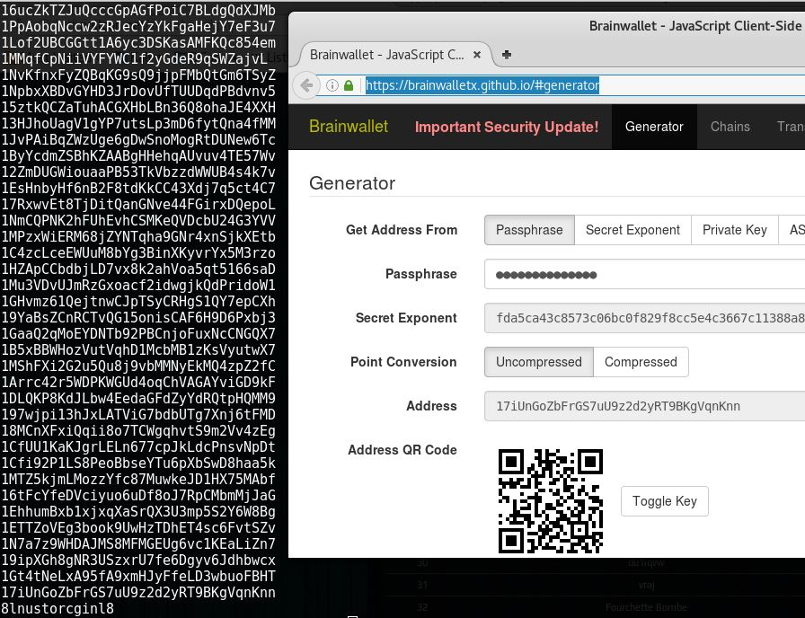

Ce CTF a été organisé par la Nullcon pour sa 7ème édition, qui aura lieu à Goa. Ce CTF indien propose plusieurs catégories comme du Web, OSINT, Pwn, RE, Crypto, Prog et MISC.

<h2>Énoncé</h2>
Lorsqu'on arrive sur l'énoncé du chall, on nous donne l'image suivante :


Nous sommes sur un générateur de clé privée/publique.
On voit ainsi que le flag est la clé privée. On a l'adresse finale (sous forme de QR-Code) et une partie de la passphrase.
<h2>Résolution</h2>
Je recherche donc le site en question, et je le trouve à cette adresse : <a href="https://brainwalletx.github.io/#generator">https://brainwalletx.github.io/#generator</a>

Je regarde l'adresse : <strong>17iUnGoZbFrGS7uU9z2d2yRT9BKgVqnKnn</strong>

Et maintenant, il ne reste plus qu'à trouver la passphrase. Le problème est que nous ne savons pas combien de caractères, quels caractères ...
Et là on peut se demander si l'image en bas à droite ne nous aide pas ?
Scrambled egg + de la purée =&gt; mélange de caractères
On suppose donc que la chaine allant avec l'image correspond à la liste des caractères possibles, on retire ceux déjà utilisés : <strong>u , c , o , i , t , s , g , r</strong>

Maintenant il nous reste plus qu'à Brute-Forcer à l'aide d'un script :

```python
#!/usr/bin/env python
 
from selenium import webdriver
from selenium.webdriver.common.keys import Keys
from itertools import permutations
import time
 
keyPub = '17iUnGoZbFrGS7uU9z2d2yRT9BKgVqnKnn'
passBeg = '8ln'
passEnd = 'nl8'

driver = webdriver.Firefox()
driver.get("https://brainwalletx.github.io/#generator")
time.sleep(5) #Temps de réponse et d'ouverture du webdriver

passphrase = driver.find_element_by_id("pass")
time.sleep(5)

addresse = driver.find_element_by_id("addr")
time.sleep(5)
 
# L'indice était : nullcon8itsgr8
# avec un "mélange" je me dis que (grâce aux 8, c'est le dictionnaire des lettres)
# et donc je prends celles qui ne sont pas utilisees : ucoitsgr

#permutations permet de gérer toutes les permutations avec une suite de caractères
perm = permutations('ucoitsgr')
#ici il y en a plus de 40 000

for i in perm:
	s = ''.join(i)
	p = passBeg + s + passEnd
	passphrase.send_keys(p)
	time.sleep(1)
	
	rep = addresse.get_attribute("value")
	print rep

	if rep == keyPub:
		print p
		break

	#on supprime ce qui est dans passphrase
	passphrase.clear()
```

Au bout d'une demi-heure, le script se termine et voici le résultat :
<h2>Récupération du flag</h2>
On voit que la passphrase était : <strong>8lnustorcginl8
</strong>Et surtout il ne nous reste plus qu'à cliquer sur "Toggle" :

Et nous avons le flag : <strong>flag{5KjzfnM4afWU8fJeUgGnxKbtG5FHtr6Suc41juGMUmQKC7WYzEG}</strong>