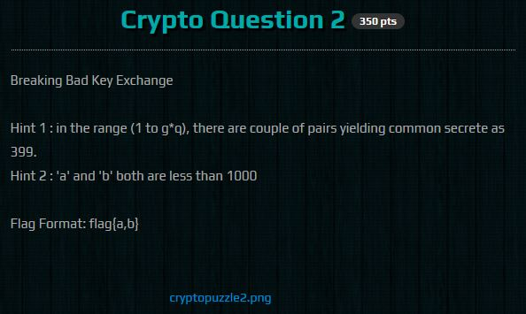
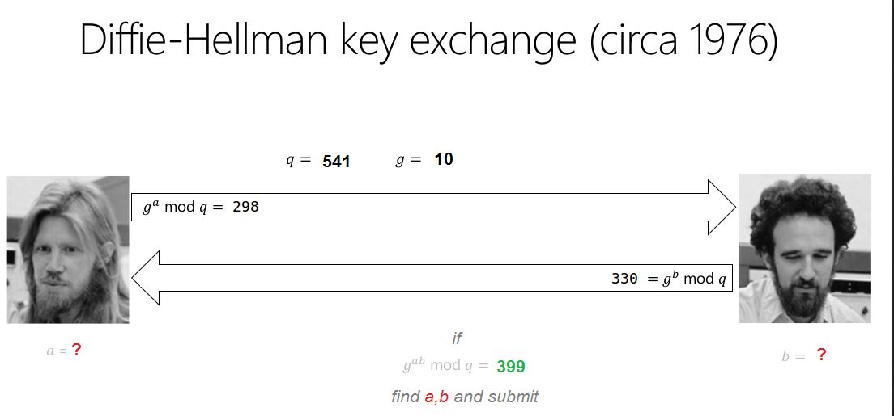
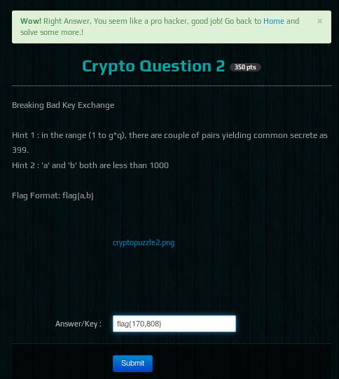

Ce CTF a été organisé par la Nullcon pour sa 7ème édition, qui aura lieu à Goa. Ce CTF indien propose plusieurs catégories comme du Web, OSINT, Pwn, RE, Crypto, Prog et MISC.

<h2>Énoncé</h2>
Lorsqu'on arrive sur l'énoncé du chall :



Et l'image cryptopuzzle2.png :


<h2>Résolution</h2>
Il faut chercher a et b, la solution se fera via un script :

```python
#!/usr/bin/env python

#Listes contenant les valeurs possibles de a et de b
listA=[]
listB=[]


for i in range(0,1000):
	if(pow(298,i,541)==399):
		#print(i)
		listB.append(i)
	if(pow(330,i,541)==399):
		#print("b="+str(i))
		listA.append(i)

for i in listA:
	if(pow(10,i,541)==298):
		print("a = "+str(i))

for i in listB:
	if(pow(10,i,541)==330):
		print("b ="+str(i))
```

Sortie du script :

a = 170
a = 710
b =268
b =808

Donc les flags possibles sont :

flag{170,268}
flag{170,808}
flag{710,268}
flag{710,808}
<h2>Récupération du flag</h2>


Le flag était :<strong> flag{170,808}</strong>