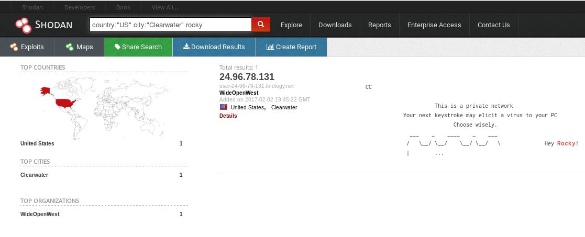
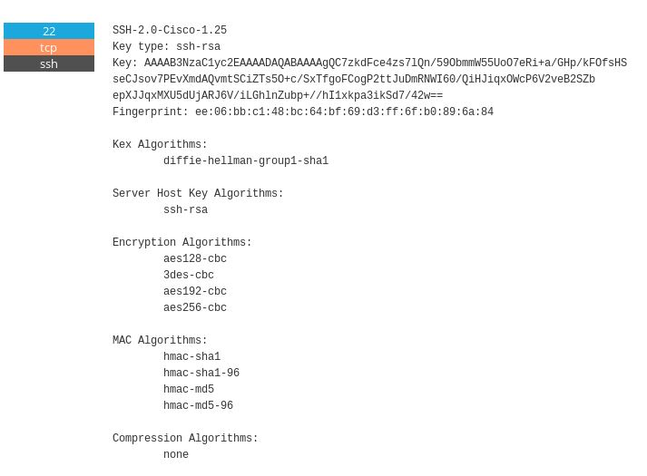

Ce CTF a été organisé par la Nullcon pour sa 7ème édition, qui aura lieu à Goa. Ce CTF indien propose plusieurs catégories comme du Web, OSINT, Pwn, RE, Crypto, Prog et MISC.

<h2>Énoncé</h2>
Lorsqu'on arrive sur l'énoncé du chall, voici les indices :

Le flag est donc le fingerprint.
<h2>Résolution</h2>
Après de multiples recherches sur les réseaux sociaux, sur internet ... J'essaye un site s'intitulant <a href="https://www.shodan.io/">Shodan</a>. C'est un moteur de recherche référençant le résultat de balayages de ports massifs effectués sur le réseau internet. Il recherche tout ce qui est connecté. Il est utilisé par des chercheurs en sécurité mais aussi des pirates voulant prendre le contrôle à distance.

On recherche donc, rocky à "Clearwater" ; une ville des États-Unis , et on trouve un résultat :

<h2>Récupération du flag</h2>
En cliquant dessus on voit de nombreux services (/ports) ouverts dont celui-ci :

Le flag est la fingerprint.