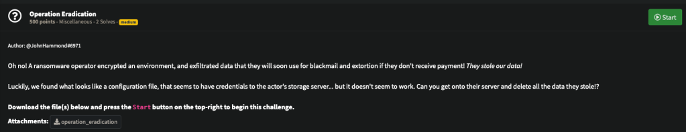
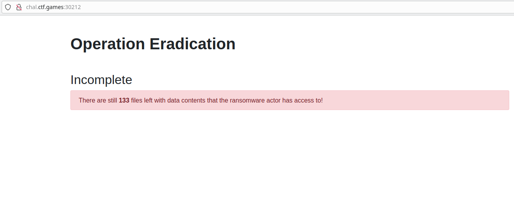
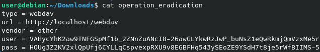
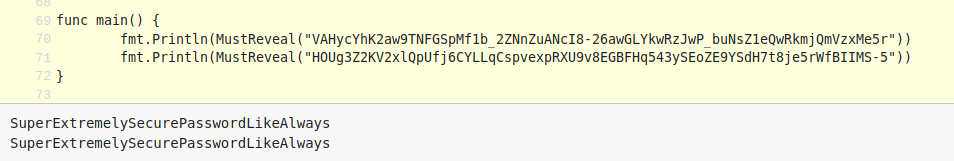
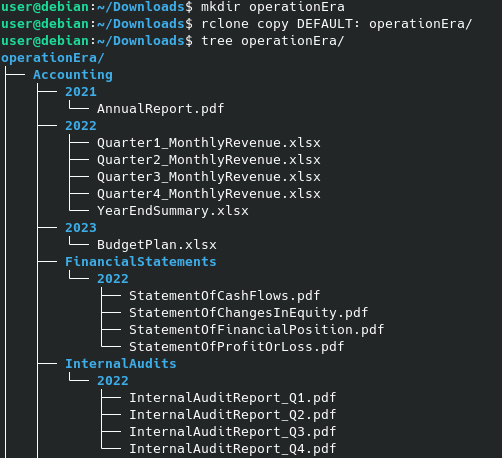
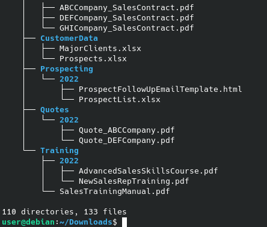
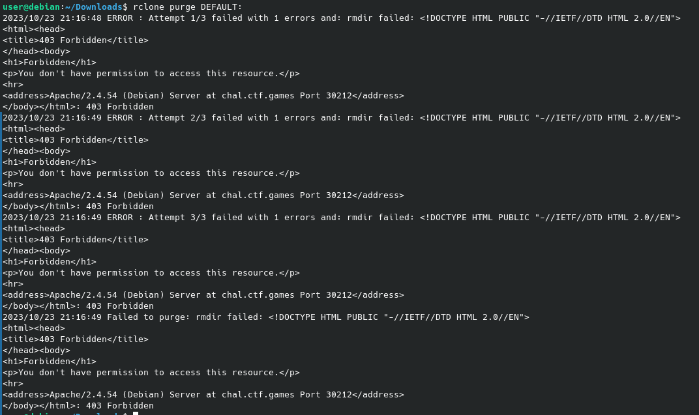
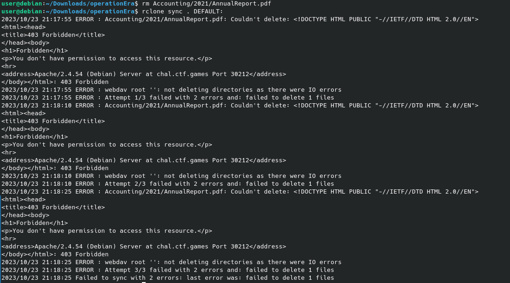
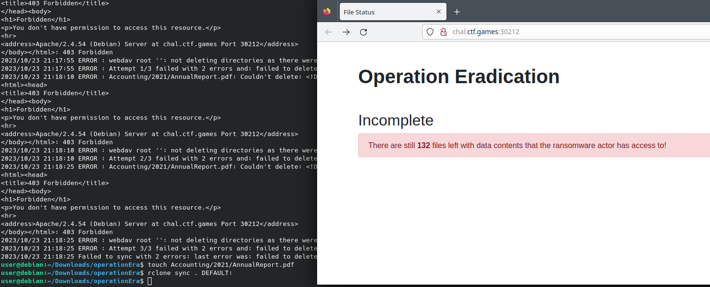
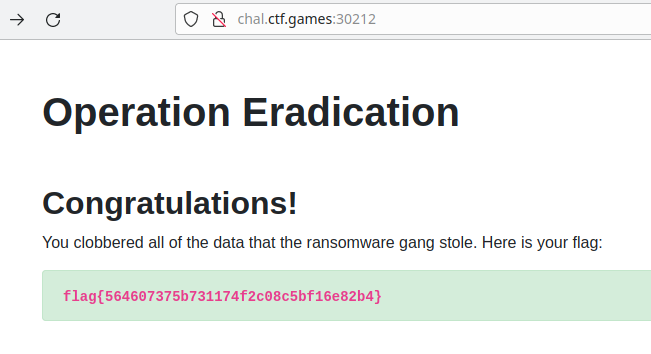

# MISCELLANEOUS - Operation Eradication

## Description

We have 1 file and 1 site.

## WebSite

When I saw the website, I understood that I must to delete the data :

So, let’s take a look at the challenge file's.

It's a rclone configuration!

With a script, I decrypt the password : *SuperExtremelySecurePasswordLikeAlways*

I can use this configuration to copy the data on my computer.

Ok, i have the 133 files!

Let's go, i will purge the depot...

I don't have the permission...

Maybe i can sync from my PC to the remote repository ! I remove 1 file and sync.

I can not delete a file, so recreate but empty !

It's work !

I do the same technique for the rest of the files and ...

