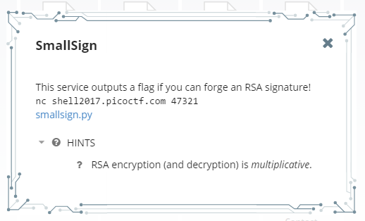
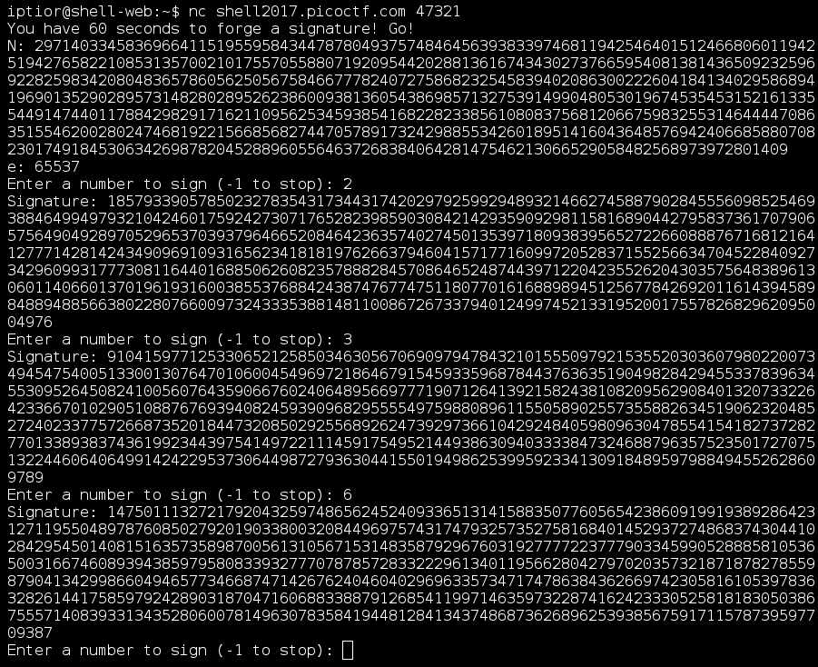

Le PicoCTF est une compétition destinée aux étudiants qui se déroulait du 31 mars au 14 avril. Le CTF est découpé en 5 niveaux de difficulté comportant plusieurs challenges de type forensic, pwn, reverse, web, crypto et misc. Le challenge présenté dans ce write-up est un crypto du niveau 4.

<h2>Énoncé</h2>


La source :
```python 
#!/usr/bin/python -u                                              

from Crypto.PublicKey import RSA                                  
import random                                                     
import signal                                                     

key = RSA.generate(2048)                                          
flag = open("./flag").read()                                      

print "You have 60 seconds to forge a signature! Go!"             
# In 60 seconds, deliver a SIGALRM and terminate                  
signal.alarm(60)                                                  

print "N:", key.n                                                 
print "e:", key.e                                                 

while True:                                                       
    m = int(raw_input("Enter a number to sign (-1 to stop): "))   
    if m == -1:                                                   
        break                                                     
    sig = key.sign(m, None)                                       
    print "Signature:", str(sig[0])                               

challenge = random.randint(0, 2**32)                              
print "Challenge:", challenge                                     
s = int(raw_input("Enter the signature of the challenge: "))      
if key.verify(challenge, (s, None)):                              
    print "Congrats! Here is the flag:", flag                     
else:                                                             
    print "Nope, that's wrong!"
```

Le but est donc de calculer la signature d'un nombre donné au hasard.

<h2>Multiplicative ?</h2>
Grâce à l'indice, je m'intéresse donc à la propriété multiplicative : a*b = c ==&gt; RSA(a)*RSA(b) = RSA(c)

Je fais un test en prenant 2 et 3 et en demandant 6 :



Après vérification, cela est bon !


<h2>Résolution</h2>
Je décide donc de créer un script permettant de calculer les signatures de nombres premiers. Puis ensuite de factoriser le nombre demandé par le serveur en nombres premiers grâce au site factordb.com . Et pour finir envoyer la signature en multipliant les signatures de ces nombres.

```python 
#!/usr/bin/env python                                             
                                                                  
import socket, sys                                                
import requests                                                   
                                                                  
server ="shell2017.picoctf.com"                                   
port = 47321                                                      
                                                                  
listeNb = open("listNBPremiers.txt").read().split("\n")           
                                                                  
trouve =0                                                         
while trouve ==0:                                                 
        bot = socket.socket(socket.AF_INET, socket.SOCK_STREAM)   
        print("connect to "+server)                               
                                                                  
        bot.connect((server,port))                                
                                                                  
        text = bot.recv(2040)                                     
#       print(text)                                               
                                                                  
        text = bot.recv(2040)                                     
#       print(text)                                               
                                                                  
        n= text.split("N:")[1].split("\n")[0]                     
#       print(n)                                                  
                                                                  
        listS ={}                                                 
                                                                  
        for i in range(0,500):                                    
                bot.send(listeNb[i]+"\n")                         
                print(bot.recv(2040) + str(i))                    
                listS[listeNb[i]]=bot.recv(2040).split("\n")[0]   
        bot.send("-1\n")                                          
        print(bot.recv(2040))                                     
        nb = bot.recv(2040).split("\n")[0]                        
                                                                  
        res = requests.get("https://factordb.com/index.php?query="+nb).content                                                      
                                                                  
        res = res.split(" = ")[1].split("</td>")[0].split("<font color=\"#000000\">")                                               
        print(res)                                                
        resu=1                                                    
        for j in range(1,len(res)):                               
                tmpN = res[j].split("</font>")[0]                 
                print(tmpN)                                       
                if("^" in tmpN):                                  
                        tmpN = tmpN.split("^")                    
                        print(tmpN)                               
                        resu = resu*(int(listS[tmpN[0]])**(int(tmpN[1])))                                                           
                else:                                             
                        if(listS.has_key(tmpN)):                  
                                resu = resu*int(listS[tmpN])      
                                trouve=1                          
                        else:                                     
                                trouve=0                          
                                                                  
        bot.send(str(resu%int(n))+"\n")                           
        print(bot.recv(2040))                                     
        print(bot.recv(2040))                                     
        bot.close()
``` 
<h2>Récupération du flag</h2>

