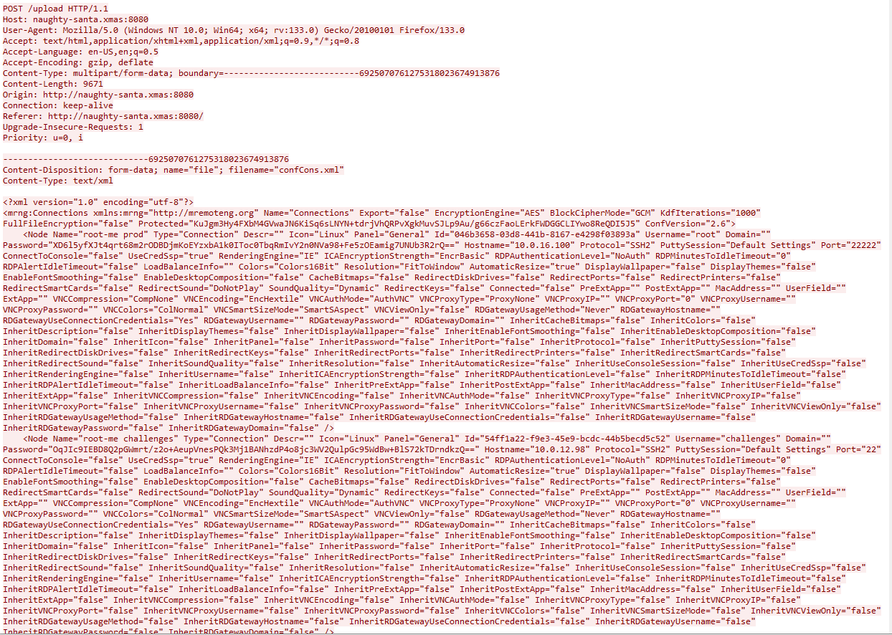

# FORENSIC - Day 09 - The Christmas Thief

## Description

We have 1 network file (PCAP) to analyze.

## Wireshark

In first, i filtred data, they are 9903 packets...
I know it's not encrypted, so ... i start with HTTP.

One website with an upload page appears ! I add a column to see the name of the file.

A conf file has been uploaded...

It's a mRemoteNG configuration file!

mRemoteNG is a fork of mRemote: an open source, tabbed, multi-protocol, remote connections manager for Windows ([link](https://mremoteng.org/ "mRemoteNG home"))

With this [doc](https://www.errno.fr/mRemoteNG.html "mRemoteNG home") and the github : https://github.com/gquere/mRemoteNG_password_decrypt/tree/master , I try to decrypt the password.

It's work !

## The Flag 

The flag is the password of this account: nishacid 

*RM{R3m0t3_cLi3Nt_4r3_n0t_S0_s3cur3}*