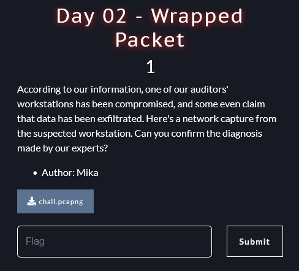
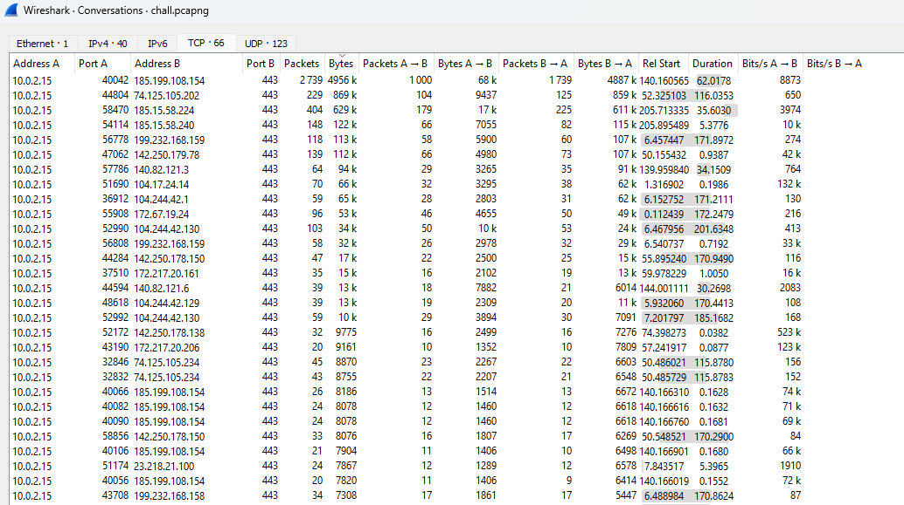
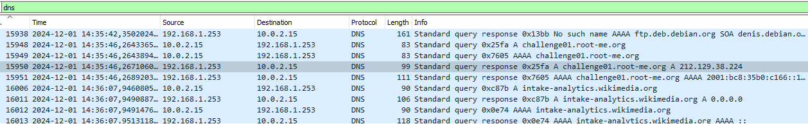
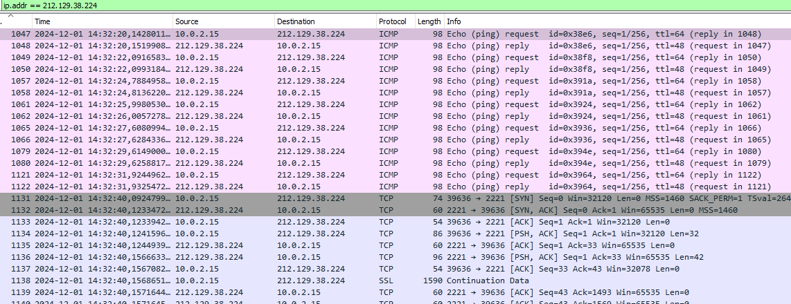
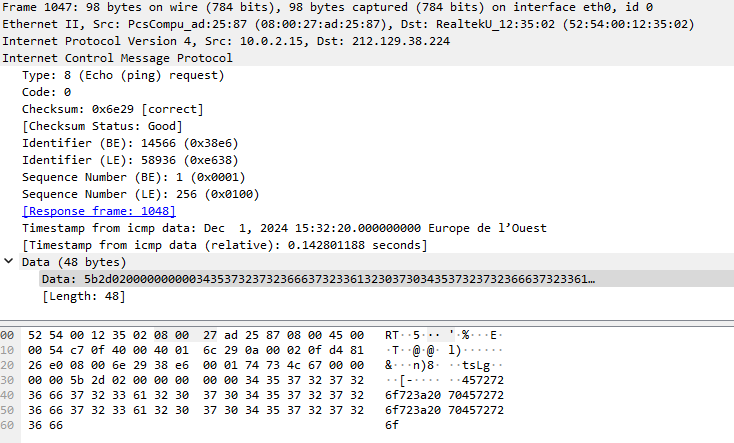
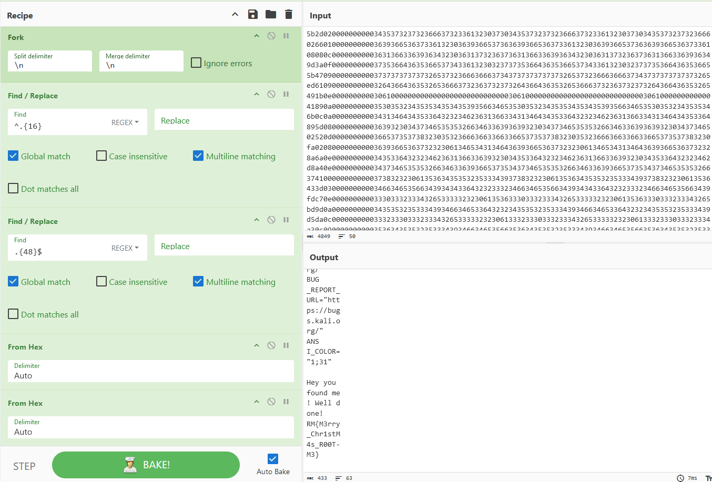
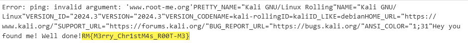

# NETWORK - Day 02 - Wrapped Packet

## Description



We have 1 network file (PCAP) to analyze.

## Wireshark

In first, i search in conversations statistics because it's an exfiltration.



But exchanges are in HTTPS, encrypted packets, so i swap my technique.
Let's see DNS traffic !



Why root-me is in request DNS?
I investigate about the IP...



2 protocoles : SSH and ICMP, one is encrypted, the other not.



Some data is present in this ICMP packet.

## Extraction of data 

I use tshark and this command line (filter on ICMP protocol and the destination IP is the root-me IP):

```tshark.exe" -r chall.pcapng -Y "icmp && ip.dst == 212.129.38.224" -T fields -e data.data```

To work on data, i use cyberchef.




## The Flag 

I concatenated the date and found the flag:



*RM{M3rry_Chr1stM4s_R00T-M3}*

