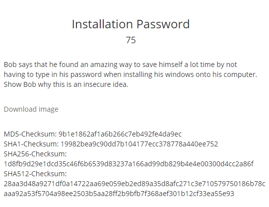
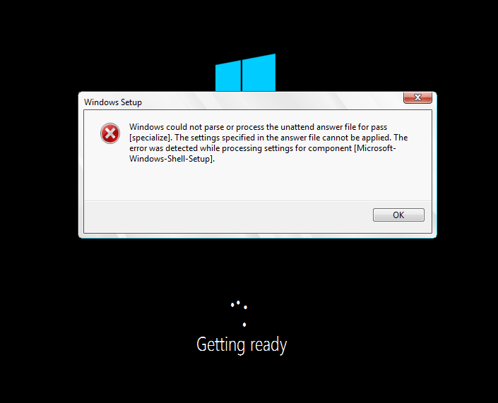

TamuCTF est le premier CTF organisé par le centre de A&amp;M Cybersecurity du Texas. Ici je vais vous présenter une épreuve de forensic.

<h2>Énoncé</h2>

<h2>Installation Windows</h2>
Nous commençons par télécharger l'image qui pèse 2.5Go. Nous voyons rapidement que c'est une iso Windows 10.
Essayons de l'installer dans une VM.

Cela charge, charge ...

Et tout d'un coup :

Erreur lors de l'installation...
<h2>Résolution du problème</h2>
Faisons un SHIFT+F10 afin d'ouvrir le terminal.

Nous sommes dans le répertoire C:/Windows/System32/

Dirigeons nous vers Sysprep avec la commande suivante
<pre> cd Sysprep</pre>
<b>Sysprep</b> est l'utilitaire Microsoft de préparation du système en vue du déploiement du système  d'exploitation Windows.

Et là nous espérons trouver le fichier unattend.xml

Bingo :D

Regardons ce qu'il y a à l'intérieur :
<pre>type unattend.xml</pre>

&nbsp;
<h2>Récupération du flag</h2>
<strong>gigem{D0n'7-dO-t4i$-!n-wIms-394839}</strong>